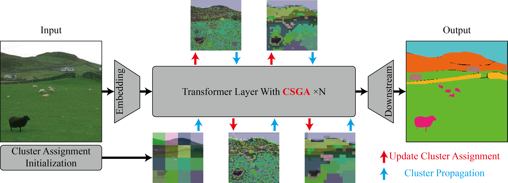

# CSGA: Enhancing Local Attention with Global Information Interaction via Progressive Cluster Propagation

# 0. Environment Configurations
- Please refer to: 
[mmpretrain](https://github.com/open-mmlab/MMPreTrain?tab=readme-ov-file), 
[mmsegmentation](https://github.com/open-mmlab/mmsegmentation), 
[mmdetection](https://github.com/open-mmlab/mmdetection), 
[NAT](https://github.com/SHI-Labs/Neighborhood-Attention-Transformer)

- All experiments were implemented under the software environment of CUDA 11.8, PyTorch 2.1.2, Python 3.9, MMCV 2.1.0 and MMEngine 0.10.5.

# 1. Classification

- ### Modify the configuration file
  - mmpretrain/configs/segformer/segformer_mit-b0_csga_4xb128_in1k-512x512.py

- ### Check the source code
  - mmpretrain/mmpretrain/models/backbones/mit_csga.py

- ### Train
  - cd mmpretain
  - CUDA_VISIBLE_DEVICES=0,1,2,3 PORT=29531 bash tools/dist_train.sh path/to/the/config_file.py 4

- ### Test
  - cd mmpretain
  - CUDA_VISIBLE_DEVICES=0,1,2,3 PORT=29532 bash tools/dist_test.sh path/to/the/config_file.py path/to/the/weights.pth 4

# 2. Segmentation

- ### Modify the configuration file
  - mmsegmentation/configs/segformer_ade20k/segformer_mit-b0_debug_2xb8-160k_ade20k-512x512.py

- ### Check the source code
  - mmsegmentation/mmseg/models/backbones/mit_csga.py

- ### Train
  - cd mmsegmentation
  - CUDA_VISIBLE_DEVICES=0,1 PORT=29531 bash tools/dist_train.sh path/to/the/config_file.py 2

- ### Test
  - cd mmsegmentation
  - CUDA_VISIBLE_DEVICES=0,1 PORT=29532 bash tools/dist_test.sh path/to/the/config_file.py path/to/the/weights.pth 2

# 3. Detection

- ### Modify the configuration file
  - mmdetection/configs/segformer/retinanet_segformer_mit-b0_csga_fpn_1x_coco2017.py

- ### Check the source code
  - mmdetection/mmdet/models/backbones/mit_debug.py

- ### Train
  - cd mmdetection
  - CUDA_VISIBLE_DEVICES=0,1 PORT=29531 bash tools/dist_train.sh path/to/the/config_file.py 2

- ### Test
  - cd mmdetection
  - CUDA_VISIBLE_DEVICES=0,1 PORT=29532 bash tools/dist_test.sh path/to/the/config_file.py path/to/the/weights.pth 2
